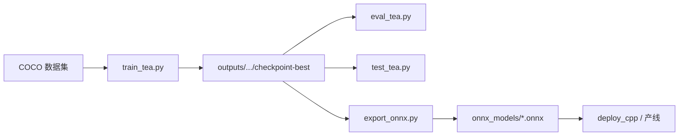

# teabud-detect

**Languages / 语言：** [简体中文](README.md) · [English](README.en.md)

在茶园图像里找出茶芽（目标检测），并支持训练、评测、导出与部署的一条龙工具库。

底层模型为 **DEIMv2**（Hugging Face `Deimv2ForObjectDetection`），骨干网络可选 **DINOv3-S / DINOv3-L** 等。数据格式为 **COCO**（`images/` + `annotations/`），与常见标注工具兼容。

---

## 它能做什么？

| 阶段 | 脚本 | 一句话 |
|------|------|--------|
| 训练 | `train_tea.py` | 在你的茶叶数据集上微调检测器 |
| 评测 | `eval_tea.py` | 多模型 × 多数据集，算 mAP 并出对比图 |
| 试跑 | `test_tea.py` | 对任意图片/文件夹推理，结果画在 `vis/` |
| 导出 | `export_onnx.py` | 把 HF checkpoint 转成 ONNX，便于 C++ / 边缘部署 |
| 看图 | `plot_train_curves.py` / `plot_eval_charts.py` | 从已有日志重绘训练曲线或评测表 |

典型工作流：



---

## 环境准备

```powershell
# 建议在项目根目录
python -m venv .venv
.\.venv\Scripts\Activate.ps1
pip install -r requirements.txt
```

若使用 **GPU 训练**，请按 [PyTorch 官网](https://pytorch.org/get-started/locally/) 安装与 CUDA 匹配的 `torch` / `torchvision`，再安装其余依赖。

首次训练会从 Hugging Face 拉取 DEIMv2 预训练权重（由 `--pretrained` / `configs/train.py` 中的 `PRETRAINED` 决定）。

---

## 目录结构（精简）

```
teabud-detect/
├── configs/          # 训练 / 评测 / 预处理 / 导出 的默认参数
├── datasets/         # 各 COCO 数据集根目录，如 teabud_march_ztu、teabud_april
├── outputs/          # 训练 checkpoint、评测结果、曲线图
├── onnx_models/      # 导出的 ONNX
├── utils/            # 训练、评测、预处理、后处理等逻辑
├── deploy_cpp/       # C++ ONNX 推理示例
├── train_tea.py      # 训练入口
├── eval_tea.py       # 批量评测入口
├── test_tea.py       # 单张/文件夹推理 + 可视化
└── export_onnx.py    # HF → ONNX
```

数据集目录需包含 `train`、`val` 划分及对应 COCO JSON（与 `pycocotools` 一致）。

---

## 配置从哪里改？

- **训练默认**：`configs/train.py`（数据集路径、`OUTPUT_DIR`、学习率、`PRESETS` 等）
- **评测默认**：`configs/eval.py`（`MODELS`、`DATASETS`、置信度、可视化抽样数）
- **预处理**：`configs/preprocess.py`（输入尺寸等，`train_tea` / `eval_tea` / `export_onnx` 共用）

命令行参数会覆盖配置文件；不想记一长串参数时，优先改 `configs/*.py` 或 `--preset`。

---

## 主要脚本怎么用？

### 1. 训练 — `train_tea.py`

在茶叶 COCO 数据上做迁移学习。默认 **冻结 DINOv3 骨干、训练检测头与 neck**；也可解冻骨干最后若干层并分层学习率（见脚本内 `--train_mode`、`--unfreeze_backbone_last_n`）。

**最快上手**（使用内置预设，改数据集路径请编辑 `configs/train.py` 中对应 `PRESETS`）：

```powershell
# 小模型 + 三月数据集，适合试跑
python train_tea.py --preset dinov3_s_march

# 完全沿用 configs/train.py 顶层默认（当前为 dinov3_l + teabud_march_ztu）
python train_tea.py
```

**常用自定义**（命令行覆盖任意项）：

```powershell
python train_tea.py `
  --pretrained dinov3_l `
  --datasets ./datasets/teabud_march_ztu `
  --output_dir ./outputs/deimv2_l `
  --batch_size 4 --lr 0.0001 `
  --train_mode backbone_frozen `
  --unfreeze_backbone_last_n 12 `
  --lr_backbone 0.0000125 --backbone_lr_decay 0.7 `
  --epochs 100
```

**断点续训**（从某次 `checkpoint-epochN` 目录恢复；若含 `training_state.pt` 会恢复优化器状态）：

```powershell
python train_tea.py --resume_from ./outputs/deimv2_l/checkpoint-epoch50 --epochs 100
```

**多数据集联合训练**（train 合并，各集 val 分别算 mAP 并打印均值）：

```powershell
python train_tea.py `
  --pretrained dinov3_l `
  --datasets ./datasets/teabud_march_ztu ./datasets/teabud_april `
  --output_dir ./outputs/deimv2_l_march_and_april `
  --batch_size 4 --epochs 200 `
  --resume_from ./outputs/deimv2_l/checkpoint-epoch100
```

训练产物（在 `--output_dir` 下）：

- `checkpoint-epochN/` — 每轮快照；`final/` 与最近一轮同步，便于中断后续训
- `checkpoint-best/` — 验证集 bbox mAP 最高时保存
- `training_run.json` — 训练过程总览；`sessions[]` 按每次启动追加（config/CLI/epoch 起止/该段最佳），顶层 `best` 为全局最佳
- `checkpoint-epochN/train_metrics.json` — 每轮损失与 mAP，供 `plot_train_curves.py` 使用

---

### 2. 批量评测 — `eval_tea.py`

对 **多个模型**（HF checkpoint 或 `.onnx`）在 **多个数据集** 的 train/val 上计算 **AP50、AP75、mAP@[0.50:0.95]**，并生成对比表与抽样可视化。

**一键跑配置里的所有模型**（模型列表见 `configs/eval.py` 的 `MODELS`）：

```powershell
python eval_tea.py
```

**只评指定模型、固定随机种子**（不同模型对同一数据集抽相同图片做对比）：

```powershell
python eval_tea.py `
  --model ./onnx_models/dino_0329_30.onnx ./outputs/deimv2_l/checkpoint-epoch100 `
  --seed 42
```

**调可视化阈值**（mAP 与训练一致；`--conf` / `--nms` 主要影响 `vis/` 里的框是否画出）：

```powershell
python eval_tea.py --conf 0.2 --nms 0.3 --val_only
python eval_tea.py --vis-conf deimv2_l_march:0.35 dino_0329_30:0.15
```

**中断后续跑**（跳过已完成的模型）：

```powershell
python eval_tea.py --resume outputs/eval/20260517_151507
# 仅按新阈值重画 vis/，不重算 mAP：
python eval_tea.py --output_dir outputs/eval/20260517_153639 --redraw-vis
```

结果目录示例：`outputs/eval/20260602_112045/`

- `metrics_*.json` — 完整数值
- `charts/` — 对比柱状图、表格 PNG/CSV/Markdown
- `vis/<数据集>_<划分>/` — 多模型竖拼对比图

仅重绘图表、不重新推理：

```powershell
python plot_eval_charts.py --resume outputs/eval/20260602_112045
```

---

### 3. 随手试一张图 — `test_tea.py`

不做 mAP，只对 **单张图或文件夹一级目录下的图片** 推理，输出画框 JPEG 到输入路径下的 `vis/`。

```powershell
# 单张
python test_tea.py --input images/HY-MD134B42F60-2602-1.png

# 整个文件夹（不递归子目录）
python test_tea.py --input images/

# 指定 checkpoint 与置信度
python test_tea.py `
  --model outputs/deimv2_l_march/checkpoint-best `
  --conf 0.25 `
  --input images/

# ONNX 模型
python test_tea.py --model onnx_models/deimv2_l_march_epoch115.onnx --input images/
```

多模型时，同一张图会 **纵向拼接** 多张对比面板，方便肉眼挑模型。

---

### 4. 导出 ONNX — `export_onnx.py`

将 Hugging Face 格式目录（含 `config.json`）导出为 ONNX；后处理（top-k、NMS 等）仍在 Python/C++ 侧完成，与 `utils.postprocess` 一致。

```powershell
python export_onnx.py outputs/deimv2_l_march/checkpoint-best

# 指定输出路径并做导出检查
python export_onnx.py outputs/deimv2_s_march/checkpoint-best `
  -o onnx_models/mymodel_epoch50.onnx --check --verify
```

默认输出名会尽量从 checkpoint 解析 epoch（避免都叫 `checkpoint-best`）。

---

### 5. 训练曲线 — `plot_train_curves.py`

读取各 run 下 `checkpoint-epoch*/train_metrics.json`，在 `outputs/train_curves/` 生成损失与 mAP 曲线。

```powershell
python plot_train_curves.py deimv2_l_march deimv2_s_march deimv2_l_april
```

---

## 训练模式速查

| `--train_mode` | 含义 |
|----------------|------|
| `backbone_frozen`（默认） | 冻结 DINOv3 骨干，训练 neck / decoder / 检测头 |
| `heads_only` | 仅训练检测头相关参数 |
| `classification_only` | 仅分类（bbox 损失为 0，一般不适合冲 mAP） |

数据增强由 `--aug_level`（1–5）控制，详见 `utils/train.py` 开头说明；**验证与 mAP 不做增强**。

---

## C++ 部署

`deploy_cpp/` 提供基于 ONNX Runtime 的推理示例（如 `DetectorDinov3.cpp`），与 Python 侧预处理、后处理约定一致。流程建议：**训练 → `export_onnx.py` → 拷贝 ONNX 到部署环境**。

---

## 依赖一览

核心：`torch`、`transformers`（DEIMv2）、`pycocotools`、`scipy`  
评测 / 可视化：`opencv-python`、`onnxruntime`、`matplotlib`、`tqdm`

完整版本见 `requirements.txt`。

---

## 小贴士

1. **先小后大**：用 `--preset dinov3_s_march` 或小 `batch_size` 确认数据与标注无误，再上大模型和长训。
2. **改默认比敲长命令**：日常实验改 `configs/train.py` / `configs/eval.py`，需要复现时再写进 shell 历史。
3. **HF 与 ONNX 对齐**：评测时同一模型请用同一套 `configs/preprocess.py`；ONNX 的 mAP 与 HF checkpoint 在相同后处理下应对齐。
4. **可视化 ≠ mAP**：`eval_tea.py` / `test_tea.py` 里较低的 `--conf` 只影响画出来的框多少，不改变 HF 路径上的 mAP 计算方式。

如有新数据集，放入 `datasets/<名称>/` 并在 `configs/train.py` 或命令行 `--datasets` 中指向即可开始训练。
