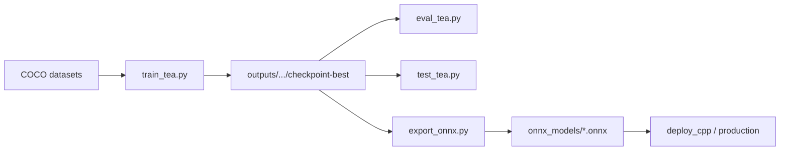

# teabud-detect

**Languages / 语言：** [简体中文](README.cn.md) · [English](README.md)

Detect tea buds in field images (object detection), with an end-to-end workflow for training, evaluation, export, and deployment.

The stack is **DEIMv2** (Hugging Face `Deimv2ForObjectDetection`) with **DINOv3-S / DINOv3-L** backbones. Annotations use **COCO** layout (`images/` + `annotations/`), compatible with common labeling tools.

---

## What can it do?

| Stage | Script | In one line |
|-------|--------|-------------|
| Train | `train_tea.py` | Fine-tune the detector on your tea datasets |
| Evaluate | `eval_tea.py` | Many models × many datasets → mAP + comparison charts |
| Try it | `test_tea.py` | Run inference on images/folders; boxes saved under `vis/` |
| Export | `export_onnx.py` | HF checkpoint → ONNX for C++ / edge deployment |
| Plot | `plot_train_curves.py` / `plot_eval_charts.py` | Re-draw training curves or eval tables from saved logs |

Typical workflow:



---

## Setup

```powershell
# From the project root
python -m venv .venv
.\.venv\Scripts\Activate.ps1
pip install -r requirements.txt
```

For **GPU training**, install `torch` / `torchvision` matched to your CUDA from the [PyTorch site](https://pytorch.org/get-started/locally/), then install the rest.

The first run downloads DEIMv2 pretrained weights from Hugging Face (`--pretrained` or `PRETRAINED` in `configs/train.py`).

---

## Layout (essentials)

```
teabud-detect/
├── configs/          # Defaults for train / eval / preprocess / export
├── datasets/         # COCO roots, e.g. teabud_march_ztu, teabud_april
├── outputs/          # Checkpoints, eval runs, curve plots
├── onnx_models/      # Exported ONNX files
├── utils/            # Train, eval, preprocess, postprocess
├── deploy_cpp/       # C++ ONNX inference sample
├── train_tea.py      # Training entry
├── eval_tea.py       # Batch evaluation entry
├── test_tea.py       # Single-folder inference + visualization
└── export_onnx.py    # HF → ONNX
```

Each dataset root needs `train` / `val` splits and COCO JSON annotations (`pycocotools`-compatible).

---

## Where to change defaults?

- **Training:** `configs/train.py` (dataset paths, `OUTPUT_DIR`, LR, `PRESETS`, …)
- **Evaluation:** `configs/eval.py` (`MODELS`, `DATASETS`, confidence, vis sample count)
- **Preprocessing:** `configs/preprocess.py` (input size; shared by `train_tea`, `eval_tea`, `export_onnx`)

CLI flags override config files. For day-to-day work, edit `configs/*.py` or use `--preset` instead of long command lines.

---

## Main scripts

### 1. Training — `train_tea.py`

Transfer learning on tea COCO data. By default the **DINOv3 backbone is frozen** while the neck and detection heads train; you can unfreeze the last N blocks with layer-wise LR (`--train_mode`, `--unfreeze_backbone_last_n`).

**Quick start** (built-in presets; edit dataset paths in `configs/train.py` → `PRESETS`):

```powershell
# Small model + March dataset — good for smoke tests
python train_tea.py --preset dinov3_s_march

# Use top-level defaults in configs/train.py (currently dinov3_l + teabud_march_ztu)
python train_tea.py
```

**Common overrides:**

```powershell
python train_tea.py `
  --pretrained dinov3_l `
  --datasets ./datasets/teabud_march_ztu `
  --output_dir ./outputs/deimv2_l `
  --batch_size 4 --lr 0.0001 `
  --train_mode backbone_frozen `
  --unfreeze_backbone_last_n 12 `
  --lr_backbone 0.0000125 --backbone_lr_decay 0.7 `
  --epochs 100
```

**Resume** (from `checkpoint-epochN`; restores optimizer if `training_state.pt` exists):

```powershell
python train_tea.py --resume_from ./outputs/deimv2_l/checkpoint-epoch50 --epochs 100
```

**Multiple datasets** (merged train; per-dataset val mAP + mean):

```powershell
python train_tea.py `
  --pretrained dinov3_l `
  --datasets ./datasets/teabud_march_ztu ./datasets/teabud_april `
  --output_dir ./outputs/deimv2_l_march_and_april `
  --batch_size 4 --epochs 200 `
  --resume_from ./outputs/deimv2_l/checkpoint-epoch100
```

Artifacts under `--output_dir`:

- `checkpoint-epochN/` — per-epoch snapshot; `final/` mirrors the latest for resume after interrupt
- `checkpoint-best/` — best val bbox mAP
- `training_run.json` — run summary; `sessions[]` appends each launch (config/CLI/epoch range/session best); top-level `best` is global
- `checkpoint-epochN/train_metrics.json` — per-epoch loss/mAP for `plot_train_curves.py`

---

### 2. Batch evaluation — `eval_tea.py`

Runs **multiple models** (HF checkpoint or `.onnx`) on **multiple datasets** (train/val), reporting **AP50, AP75, mAP@[0.50:0.95]**, plus comparison tables and sample visualizations.

**Run all models in config** (`MODELS` in `configs/eval.py`):

```powershell
python eval_tea.py
```

**Selected models + fixed seed** (same images across models for fair vis comparison):

```powershell
python eval_tea.py `
  --model ./onnx_models/dino_0329_30.onnx ./outputs/deimv2_l/checkpoint-epoch100 `
  --seed 42
```

**Visualization thresholds** (mAP matches training; `--conf` / `--nms` mainly affect boxes drawn in `vis/`):

```powershell
python eval_tea.py --conf 0.2 --nms 0.3 --val_only
python eval_tea.py --vis-conf deimv2_l_march:0.35 dino_0329_30:0.15
```

**Resume** (skip finished models):

```powershell
python eval_tea.py --resume outputs/eval/20260517_151507
# Re-draw vis/ only with new thresholds, no mAP recompute:
python eval_tea.py --output_dir outputs/eval/20260517_153639 --redraw-vis
```

Example output: `outputs/eval/20260602_112045/`

- `metrics_*.json` — full numbers
- `charts/` — bar charts, tables (PNG/CSV/Markdown)
- `vis/<dataset>_<split>/` — stacked multi-model panels

Re-plot charts without re-inference:

```powershell
python plot_eval_charts.py --resume outputs/eval/20260602_112045
```

---

### 3. Quick inference — `test_tea.py`

No mAP — inference on **a single image or one-level folder**; boxed JPEGs go to `vis/` under the input path.

```powershell
# Single image
python test_tea.py --input images/HY-MD134B42F60-2602-1.png

# Folder (non-recursive)
python test_tea.py --input images/

# Checkpoint + confidence
python test_tea.py `
  --model outputs/deimv2_l_march/checkpoint-best `
  --conf 0.25 `
  --input images/

# ONNX
python test_tea.py --model onnx_models/deimv2_l_march_epoch115.onnx --input images/
```

With multiple models, panels for the same image are **stacked vertically** for easy comparison.

---

### 4. Export ONNX — `export_onnx.py`

Exports a Hugging Face directory (with `config.json`) to ONNX. Post-processing (top-k, NMS, …) stays in Python/C++, aligned with `utils.postprocess`.

```powershell
python export_onnx.py outputs/deimv2_l_march/checkpoint-best

# Custom path + checks
python export_onnx.py outputs/deimv2_s_march/checkpoint-best `
  -o onnx_models/mymodel_epoch50.onnx --check --verify
```

Default filenames try to include the epoch parsed from the checkpoint (not always `checkpoint-best`).

---

### 5. Training curves — `plot_train_curves.py`

Reads `checkpoint-epoch*/train_metrics.json` per run and writes plots to `outputs/train_curves/`.

```powershell
python plot_train_curves.py deimv2_l_march deimv2_s_march deimv2_l_april
```

---

## Training modes

| `--train_mode` | Meaning |
|----------------|---------|
| `backbone_frozen` (default) | Freeze DINOv3 backbone; train neck / decoder / heads |
| `heads_only` | Train detection-head parameters only |
| `classification_only` | Classification only (bbox loss off — poor for mAP) |

Augmentation: `--aug_level` 1–5 (see `utils/train.py`). **Val and mAP use no augmentation.**

---

## C++ deployment

`deploy_cpp/` includes ONNX Runtime sample code (e.g. `DetectorDinov3.cpp`) with the same preprocess/postprocess contract as Python. Suggested path: **train → `export_onnx.py` → copy ONNX to the deployment environment**.

---

## Dependencies

Core: `torch`, `transformers` (DEIMv2), `pycocotools`, `scipy`  
Eval / vis: `opencv-python`, `onnxruntime`, `matplotlib`, `tqdm`

See `requirements.txt` for pinned versions.

---

## Tips

1. **Start small:** `--preset dinov3_s_march` or a small `batch_size` to validate data/labels before long runs on large models.
2. **Prefer config over long CLI:** edit `configs/train.py` / `configs/eval.py` daily; save exact commands when you need reproducibility.
3. **Align HF and ONNX:** use the same `configs/preprocess.py`; mAP should match between HF and ONNX with identical post-processing.
4. **Visualization ≠ mAP:** lower `--conf` in `eval_tea.py` / `test_tea.py` only changes drawn boxes, not HF mAP computation.

Add a new dataset under `datasets/<name>/` and point `--datasets` or `configs/train.py` at it to start training.
